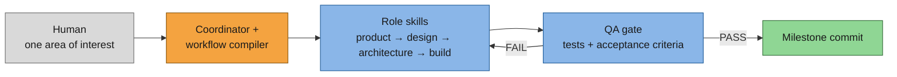
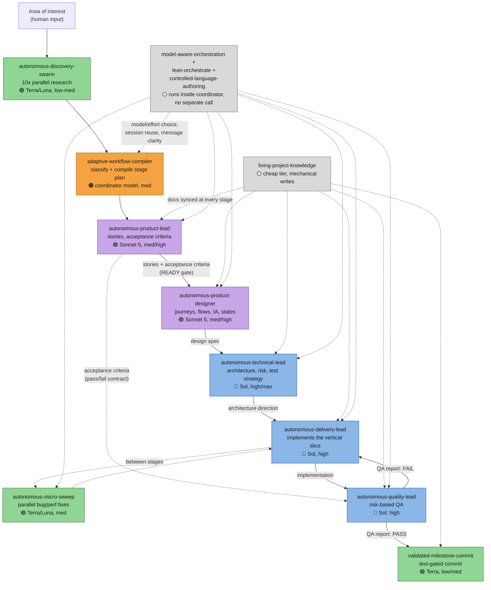

# agent-skills

*A skill set that drives autonomous, agentic software development: give it a goal in plain English, and it plans, builds, tests, documents, and commits the change on its own.*



One area of interest goes in. The coordinator plans it, the role skills build it stage by stage, QA gates the result, and a passing run ends in a validated commit. The workflow is not fixed: the compiler assembles a different stage sequence per task, and a failed QA pass sends the loop back to fix the problem and try again — automatically, step by step — rather than stopping at the first failure.

This repository provides a multi-agent development-loop skill system. The system runs on any agent harness that supports the `SKILL.md` skill format and sub-agent delegation, including GitHub Copilot CLI and Claude Code. It turns the harness into a self-directed product-and-engineering team.

## Example triggers

The human message that starts a run can be broad, scoped, or feature-shaped. The workflow compiler classifies effort from whatever comes in — it does not require a fixed prompt format. Three real trigger patterns, generalized to remove project names:

1. **Open-ended, unattended.** No area of interest is named. The discovery swarm finds it.

   > "Find useful work to do in this repo and autonomously run full loop to execute it. Stop asking for my password, I am away from keyboard. Ask me only once in the future."

   This routes straight through discovery, lets the compiler pick the smallest useful objective from repository evidence, and runs the full role chain without a human checkpoint until the final commit.

2. **Scoped bug-hunt, explicit skill and effort.** The human names the skill, the effort tier, the bug class (not just one repro), and the guardrails.

   > "Run the autonomous-development-loop skill at HIGH effort for the following area of interest: [feature] reliability bugs. Reported bug (starting point, not the only scope): [specific repro]. Goal: find and fix ALL bugs of this class, not just the one reported. This session IS the dedicated worktree for this bug-hunt — do not touch unrelated code unless a fix genuinely requires it. Commit at meaningful milestones once tests pass. Do not push unless explicitly asked."

   This skips discovery (root cause is already partly known), pins the effort tier, and constrains delivery to a single-writer scope explicitly.

3. **Feature request, no skill named.** The human describes a product change in plain language and asks for the full loop; the compiler infers scope and effort from the request itself.

   > "We need a plug-in system for icons instead of images. I want this to work entirely on vectors — text, primitives, and imported packs. This probably needs a wider redesign, both for import and later use. Full development loop please, high effort."

   No stage is named explicitly. The compiler still runs product → design → architecture → build → QA, because the request implies a redesign with open product and architecture questions, not a mechanical patch.

## Concept

The system mirrors two patterns. First, the mixture-of-experts pattern some frontier LLMs use internally: a router sends each unit of work to the specialist best suited for it, instead of one dense model handling everything. Second, the formal process a software company already runs: product, design, architecture, build, QA, docs, release, with one owner per handoff. The coordinator acts as the router. The role skills act as the experts. The artifact-gated stages enforce the process.

Neither pattern is novel by itself. This system makes the combination executable as a skill graph, so a harness can run the process end to end without a human in the loop for routine decisions.

### Optimization target

The system optimizes for execution quality and autonomy first. Token and model efficiency come second, as a constraint, not the primary goal.

- Route bounded, parallelizable work (discovery, sweeps, mechanical fixes) to cheap, fast models.
- Reserve higher-effort models for the coordinator seat and for stages that require judgment.
- Do not ask the human routine questions during a run. Ask only when a decision changes scope, risk, or irreversible state.

This allocation lets the loop run unattended for long stretches. Measured result: a from-scratch feature slice of meaningful complexity — discovery through implementation, QA, docs, and a validated commit — completed end to end in about 90 minutes with Claude Sonnet 5 (medium effort) as the coordinator, without routine human intervention.

### Emergent effect: quality from autonomy, not instead of it

Pushing for autonomy turned out to raise solution quality as a side effect, not trade against it. A vague area of interest — a feeling, not a spec — is enough input: the discovery swarm reads the existing codebase before any stage plans anything, so the resulting work integrates with what is already there instead of bolting on a parallel implementation. Because the loop is not allowed to stop at the first visible symptom (`autonomous-development-loop` calls jumping straight to a fix "the primary failure mode this loop exists to prevent"), it keeps investigating past the reported issue and surfaces the same class of pitfall elsewhere in the code, then fixes that too, in the same run. This was not the original goal — it fell out of building the sequencing and evidence rules needed to let the loop run unattended for an hour or more without a human catching its mistakes.

## Problems this solves

Autonomous multi-agent loops fail in predictable ways. Each rule in this system exists to close one documented failure mode.

1. **Jumping straight to the fix.** `autonomous-development-loop` names this directly: *"The urge to jump straight to code is the primary failure mode this loop exists to prevent."* A visible bug does not authorize an edit; the loop requires a `StrategyReadinessVerdict: READY` artifact before any production-code change, "no matter how obvious the fix looks."
2. **Redundant re-discovery from disposable sub-agents.** `model-aware-orchestration` treats a sub-agent's explored context as sunk cost: *"That context — explored files, build behavior, constraints already understood — is paid-for capital; relaunching a fresh agent for the same role and scope pays again."* The fix is to message an idle agent instead of respawning one.
3. **Two agents writing the same surface.** The same skill states plainly: *"a shared working tree never admits two writers, even with disjoint source files (builds, indexes, and the git index race)."* Delivery work keeps one writing agent per overlapping code surface at a time.
4. **QA that grades the code against itself.** `autonomous-quality-lead` will not sign off work whose tests were weakened to pass: *"Changing or deleting a planned acceptance test requires a `ReworkRequest`, not a local edit."* Acceptance criteria come from the product role before implementation, so QA checks intent, not the implementation's own assumptions.
5. **Escalating model tier "to be safe."** `model-aware-orchestration` requires evidence before spending more: *"start at the cheapest tier that could plausibly succeed... escalate exactly one tier at a time only on an explicit signal"* and *"never escalate preemptively... never skip more than one tier without evidence."*

## Architecture

The loop enforces five structural rules. Together, they bound risk, prevent conflicting writes, keep the loop cheap to run at scale, and let it recover from its own mistakes without stopping.

1. **Artifact-gated state machine.** The loop advances from one stage to the next only when the current stage produces its required artifact: brief, stories, design spec, architecture direction, implementation, QA report, or docs update. No stage starts on an incomplete predecessor.
2. **Adaptive stage sequencing.** `adaptive-workflow-compiler` selects the stage sequence per task from reusable stages, rather than running one fixed pipeline for every request; a mechanical fix and a ground-up redesign compile into different sequences.
3. **ATDD chain.** The product role authors acceptance criteria before implementation starts. The quality role uses those criteria as the pass/fail contract for QA. This validates behavior against intent, not against the implementation itself.
4. **Single-writer delegation.** One agent owns the write to a given file or slice at a time. Sub-agents run in parallel only for independent research or sweeps. The loop never delegates concurrent writes to the same surface to two agents.
5. **Warm-agent reuse.** The coordinator messages idle background agents with follow-ups instead of respawning them. This preserves their context and avoids redundant re-discovery.

### Iteration and error recovery

A QA fail is not a stop condition. `autonomous-development-loop` raises a `ReworkRequest` that names the earliest upstream stage the failure actually traces back to, returns execution to that stage, then re-flows forward through every stage after it — the loop fixes the root cause and re-validates the whole chain, not just the symptom. A budget caps this at two targeted reworks per slice before a full re-plan; the loop does not retry the same fix indefinitely.

### Message protocol

Coordinator-to-role and coordinator-to-swarm messages follow one shape:

- Bounded scope: one slice, one stage, or one research angle per call.
- Complete context up front: sub-agents are stateless per invocation unless kept warm.
- A structured result: status, artifact location, findings, and follow-ups — not free-form narration.



| 🟠 coordinator | 🟣 judgment | 🔵 coding/QA | 🟢 cheap/parallel | ⚪ support |
| --- | --- | --- | --- | --- |
| plan owner | product/design | Sol-class, high | Terra/Luna | always-on, no separate call |

| Edge | Meaning |
| --- | --- |
| `──▶` solid | Blocking handoff: next stage waits on this artifact (single-writer gate). |
| `┄┄▶` dashed | Non-blocking: parallel sub-agent call or cross-cutting reference, no stage waits on it. |

Read the diagram top to bottom: the discovery swarm and workflow compiler run once per area of interest. The role chain (D→E→F→G→I) runs single-writer, stage-gated: each arrow is a required artifact, not a suggestion. `autonomous-micro-sweep` runs in parallel between stages, never on the same file the current stage owns. The loop only reaches `validated-milestone-commit` on a QA `PASS`; a `FAIL` returns control to delivery, not to the human.

## Components

Model tier legend: 🟠 coordinator-held · 🟣 judgment/Sonnet-class · 🔵 coding/Sol-class · 🟢 fixed cheap tier · ⚪ inline, no dedicated model. Full routing table in Architecture.

### Coordinator

- `autonomous-development-loop`
  - Runs the end-to-end loop from a single area of interest.
  - Sequences discovery, design, technical direction, implementation, documentation, testing, QA, and a test-gated commit.
  - Model: 🟠 coordinator, once per run.

### Workflow compiler

- `adaptive-workflow-compiler`
  - Classifies requested work as low, medium, or high effort.
  - Compiles a task-specific workflow from reusable stages: discovery, story, journey, flow, design, architecture, implementation, QA, documentation, commit.
  - Model: 🟠 coordinator, medium.

### Delivery

- `autonomous-delivery-lead`
  - Implements a vertical slice.
  - Coordinates bounded coding agents, keeps docs in sync, validates incrementally, prepares milestone commits.
  - Model: 🔵 Sol, high.

### Role skills

- `autonomous-product-lead`
  - Defines needs, opportunities, stories, acceptance criteria, and backlog.
  - Model: 🟣 Sonnet, med/high.
- `autonomous-product-designer`
  - Defines journeys, flows, information architecture, accessibility, visual hierarchy, and state design.
  - Model: 🟣 Sonnet, med/high.
- `autonomous-technical-lead`
  - Defines architecture, refactoring, migration, testability, security, and performance direction.
  - Model: 🔵 Sol, high/max.
- `autonomous-quality-lead`
  - Reviews strategy readiness and runs risk-based QA: unit, integration, snapshot, screenshot, accessibility, runtime, performance, regression.
  - Model: 🔵 Sol, high.
- `living-project-knowledge`
  - Keeps product, design, architecture, backlog, decisions, QA, and performance docs synchronized with each stage.
  - Model: 🟢 cheap tier, low.

### Swarms

- `autonomous-discovery-swarm`
  - Runs up to 10 parallel read-only research sessions, each exploring the repository from a distinct angle before planning starts.
  - Model: 🟢 `gpt-5.6-luna`, low/med, fixed.
- `autonomous-micro-sweep`
  - Runs up to 10 parallel bug-hunt sessions; each commits one small fix, or returns a proposed patch, then a consolidated review pass runs. Also runs in performance mode as a loop stage.
  - Model: 🟢 `gpt-5.6-luna`, med, fixed.

### Support skills

- `lean-orchestrate`
  - Coordinates multi-step or multi-repo work; minimizes new worktrees and branches; reuses open sessions.
  - Model: ⚪ inline, none.
- `model-aware-orchestration`
  - Selects models and effort levels for sub-agents; defines the context-preserving delegation policy.
  - Model: ⚪ inline, none.
- `controlled-language-authoring`
  - Defines the writing rules for agent-facing instructions, so prompts and kickoff messages stay unambiguous across model tiers.
  - Model: ⚪ inline, none.
- `readme-abstraction-ladder`
  - Optional, separately callable. Writes or restructures a README as an abstraction ladder: strictly increasing detail from a plain-English tagline through usage examples, concept, problems solved, components, and architecture. Not part of the loop.
  - Model: ⚪ inline, none.
- `validated-milestone-commit`
  - Commits a completed chunk only after tests, QA, docs, and runtime or visual checks pass; produces precise conventional commit messages.
  - Model: 🟢 cheap tier.

## Install

Each skill is a plain `SKILL.md` file with an optional `references/` directory. This is the same format GitHub Copilot CLI and Claude Code use to discover skills.

Symlink each skill into your harness's skill directory. Symlinking keeps this repository as the source of truth:

```bash
# GitHub Copilot CLI
for d in skills/*/; do
  name="$(basename "$d")"
  ln -s "$(pwd)/$d" "$HOME/.copilot/skills/$name"
done

# Claude Code
for d in skills/*/; do
  name="$(basename "$d")"
  ln -s "$(pwd)/$d" "$HOME/.claude/skills/$name"
done
```

Copy the skills instead if you want an independent snapshot. Adjust the destination path for your harness:

```bash
cp -R skills/* ~/.copilot/skills/   # or ~/.claude/skills/, or your harness's skill directory
```

The harness loads each `SKILL.md` and its `references/` automatically once the files exist in its skill directory. If your harness uses a different discovery path or a manifest registry, point it at `skills/*` the same way. No file in this repository depends on a Copilot-specific API beyond the install path.

## Status

This is a living system. It evolves continuously as the skills run in practice. A `benchmarks/` directory — task suites and before/after evidence for the loop and its role skills — is planned but not yet present.

## License

MIT. See `LICENSE`.
