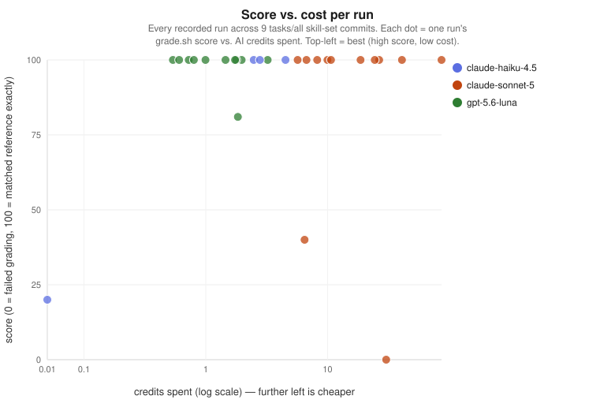
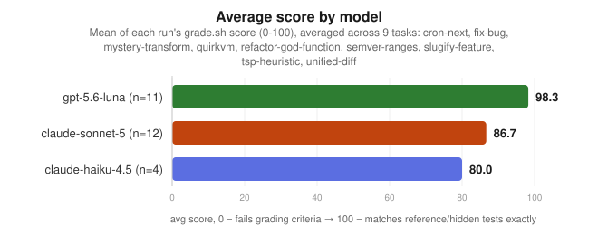
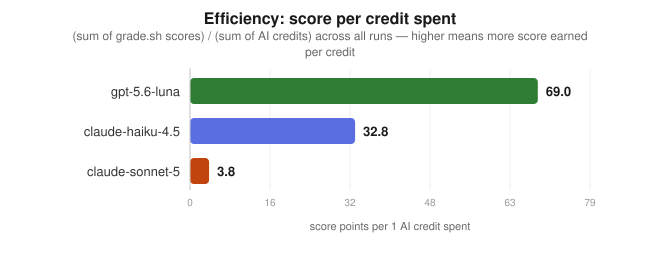
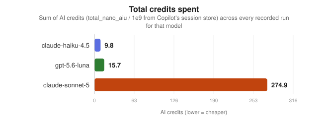

# Skill-set benchmark

Measures the **effectiveness and resource cost** of the skill set in this repo when run
through Copilot CLI. Every run is tagged with the repo commit, so you can compare skill-set
versions over time, and A/B skills-on vs skills-off.

## How it works

- Each task in `tasks/<name>/` has a `prompt.md`, an optional `fixture/` starting repo, and
  a deterministic `grade.sh` that prints a 0–100 score.
- `run.sh` copies the fixture to a temp dir, runs `copilot -p` non-interactively with a
  pinned session UUID, grades the outcome, then reads exact usage (input/output tokens,
  AI credits, request count, turns) for that session from Copilot's local
  `session-store.db`.
- Results append to `results/runs.jsonl`; `report.sh` summarizes by
  (skill-set commit, variant, model).

## Usage

```bash
# full hard suite, skills-on (your real ~/.copilot with this repo's skills symlinked)
bench/run.sh --model claude-sonnet-5

# baseline without any skills (isolated COPILOT_HOME, auth via `gh auth token`)
bench/run.sh --model claude-sonnet-5 --variant skills-off

# single task / smoke tier / custom caps
bench/run.sh --task quirkvm --model gpt-5.6-luna
bench/run.sh --tasks-dir smoke --task fix-bug --model claude-haiku-4.5
bench/run.sh --task tsp-heuristic --timeout 900 --max-credits 60

# summary table
bench/report.sh

# regenerate the charts below from results/runs.jsonl (pure stdlib, no deps)
python3 bench/make_charts.py
```

## Charts

Generated from every valid run recorded in `results/runs.jsonl` (all tasks, all skill-set
commits so far). Regenerate after any new run with `python3 bench/make_charts.py` — it's
pure-stdlib SVG, no plotting libraries required. Hover a point in the scatter (rendered SVG,
e.g. on GitHub) to see the task/score/credits in a tooltip.

**Score vs. cost — the single-graph comparison across models:**



**Average score by model (all recorded runs):**



**Efficiency — score delivered per credit spent:**



**Total credits spent across all recorded runs:**



## Containment

Benchmark agents run headless but NOT uncontrolled. Each run is sandboxed by `run.sh`:

- tool allowlist only (`shell`, file read/write/edit tools) — no MCP servers
  (built-ins disabled, every server in `mcp-config.json` explicitly disabled), no web
  (`--deny-url='*'`), no remote export
- file access confined to the per-run temp workdir (no `--allow-all-paths`)
- hard AI-credit cap per run (`--max-ai-credits`, default 30 — the CLI minimum; raise
  per-task with `--max-credits`)
- hard wall-clock cap via GNU `timeout` (default 600 s, `--timeout` to override), which
  kills the whole process tree
- runs execute sequentially in the foreground of the invoking shell — no detached loops

## Metrics per run

| field | source |
|---|---|
| `score` (0–100) | task `grade.sh` (tests pass, hidden acceptance checks, structural rules, files untouched) |
| `input_tokens` / `output_tokens` / `cache_read_tokens` | `assistant_usage_events` in session store |
| `credits` | `total_nano_aiu / 1e9` (real AI credit cost) |
| `turns` / `requests` | session store |
| `wall_seconds`, `exit_code` | runner |
| `skillset_commit` + `skillset_dirty` | `git rev-parse` of this repo |

`report.sh` also derives **score per credit** — the headline efficiency number.

## Tasks

The main suite (`tasks/`) is deliberately hard: calibrated so current frontier models land
near ~50, leaving headroom to measure future improvement. Scores are weighted fractions of
hidden ground-truth cases (generated from reference implementations: node-semver, croniter,
difflib), with edge cases weighted heaviest.

| task | axis | ground truth | hard parts |
|---|---|---|---|
| `semver-ranges` | spec-compliance implementation | node-semver | prerelease exclusion rule, partial hyphen ranges, build metadata. Score normalized above chance (constant answers → 0) |
| `cron-next` | algorithmic edge cases | croniter | DOM/DOW union rule, leap years, impossible dates, name ranges |
| `unified-diff` | exact-output algorithm | difflib (banned in solution) | hunk merging, `@@ -4 +4 @@` count omission, zero-context, empty files |
| `quirkvm` | precise spec-following on an invented machine | custom reference interpreter (60 hidden random programs) | anti-intuitive rules: bottom-discard stack cap, reversed REP blocks, error-flag PRINT semantics, mixed wrap/saturate arithmetic |
| `mystery-transform` | inductive reasoning from examples | secret 6-rule composition, 50 held-out cases | rule interactions and application order; memorizing train.json scores 0 |
| `tsp-heuristic` | open-ended optimization under time budgets | NN+2-opt(neighbor lists)+Or-opt reference tours | continuous score (frac^4 of NN→ref gap closed); naive 2-opt ≈ 56, well-pruned 2-opt ≈ 67, 100 needs beating the reference in tight budgets |

The original easy tasks live in `smoke/` (ceiling reached — every model scores 100; useful
as harness smoke tests): run them with `bench/run.sh --tasks-dir smoke`.

| task | axis | key checks |
|---|---|---|
| `fix-bug` | debugging | provided tests pass, test file untouched |
| `slugify-feature` | feature + self-written tests | hidden acceptance checks, agent's own tests pass, existing code untouched |
| `refactor-god-function` | refactoring discipline | behavior preserved, AST check: ≥4 functions, ≤15 lines each, signature stable |

## Adding a task

```
tasks/my-task/
  prompt.md    # what the agent is asked to do
  fixture/     # starting files (committed as git baseline in the workdir)
  grade.sh     # runs in the workdir, prints integer 0-100 on stdout
```

Guidelines: make grading deterministic (tests, hidden asserts, AST/structure checks,
`git diff --quiet` for files that must not change). Verify the untouched fixture scores
low before trusting the task.

## Interpreting results

- **skills-on vs skills-off at equal score** → skills overhead; expected on trivial tasks.
  Skills should pay off on tasks matching their domain (add such tasks to test specific skills).
- **Same variant across commits** → regression tracking for skill-set changes.
- Model nondeterminism is real: run each configuration 3+ times before drawing conclusions
  (`for i in 1 2 3; do bench/run.sh ...; done`).
